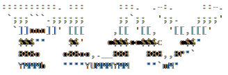
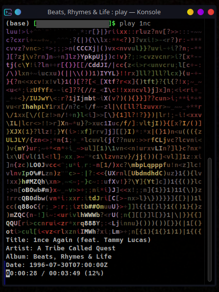

# play

Listen to music in the terminal.

<div align="center">
    
</div>
<div align="center">
    
</div>

Play is a command-line music player for Linux.

## Features
 
 * Search a music library with partial words from a directory, song or playlist.
 * Display album covers as ASCII art.
 * Display meta tags from the music being played.
 * Control the player with previous, next and pause.

## Installing Prerequisites

play requires FFmpeg and a TrueColor capable terminal, like Konsole, kitty or st, to display colors properly.

For a complete list of capable terminals, see this page: [Colors in Terminal](https://gist.github.com/CMCDragonkai/146100155ecd79c7dac19a9e23e6a362) (github.com).

FFmpeg might be installed already, if not install it using your distro's package manager.

## How to install

 ```
% git clone https://github.com/ravachol/play.git

% cd play

% make

% sudo make install
 ```

## Running play

IMPORTANT! Tell play the path to your music library (you only need to do this once):

```
% play path "/home/joe/Music/"
```
Now run play and provide a partial name of a track, playlist or directory:

```
% play cure great
```

This command plays all songs from "The Cure Greatest Hits" directory, provided it's in your music library, and prints out the album cover in colorful ASCII on the screen!

#### Some Examples:

 ```
% play moonlight son (finds and plays moonlight sonata)

% play moon (finds and plays moonlight sonata)

% play beet (finds and plays all music files under "beethoven" directory)

% play dir <album name> (sometimes it's neccessary to specify it's a directory you want)

% play song <song name> (or a song)

% play --help, -? or -h

% play --version or -v
 ```

#### Other Functions:

* Use <kbd>↑</kbd>, <kbd>↓</kbd> keys to raise or lower volume. 
* Use <kbd>→</kbd>, <kbd>←</kbd> keys to play the next or previous track in the playlist. 
* Press <kbd>Space</kbd> to pause.
* Press <kbd>Esc</kbd> to quit.

## License

Licensed under GPL. [See LICENSE for more information](https://github.com/ravachol/play/blob/main/LICENSE).