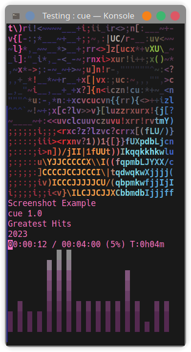

# cue

Listen to music in the terminal.

<div align="center">
    
</div>

cue is a command-line music player for Linux.

## Features
 
 * Search a music library with partial titles
 * Display album covers as ASCII art or as a normal image.
 * Creates a playlist automatically based on matched directory name
 * Control the player with previous, next and pause.
 * A main playlist that you can add to by pressing 'a' when listening to any song. Load the playlist by running cue with no arguments.

## Quick Installation

To quickly install cue, just copy and paste it to your terminal:

```bash
sudo bash -c "curl https://raw.githubusercontent.com/ravachol/cue/main/install.sh | bash"
```

## Manual Installation

cue dependencies are:

* FFmpeg
* FFTW
* Chafa
* FreeImage
* glib2.0 and AVFormat. These should be installed with the others, if not install them.

A TrueColor capable terminal is recommended, like Konsole, kitty or st, to display colors properly.

For a complete list of capable terminals, see this page: [Colors in Terminal](https://gist.github.com/CMCDragonkai/146100155ecd79c7dac19a9e23e6a362) (github.com).

Install FFmpeg, FFTW, Chafa and FreeImage using your distro's package manager. For instance:

```bash
apt install ffmpeg libfftw3-dev git libchafa-dev libfreeimage-dev libglib2.0-dev libavformat-dev
```
Or:

```bash
pacman -Syu ffmpeg fftw git chafa freeimage
```
Then run:

```bash
git clone https://github.com/ravachol/cue.git
```
```bash
cd cue
```
```bash
make
```
```bash
sudo make install
```

## Usage

IMPORTANT! Tell cue the path to your music library (you only need to do this once):

```bash
cue path "/home/joe/Music/"
```
Now run cue and provide a partial name of a track or directory:

```bash
cue cure great
```

This command plays all songs from "The Cure Greatest Hits" directory, provided it's in your music library, and prints out the album cover in colorful ASCII on the screen!

cue returns the first directory or file whose name matches the string you provide.

#### Some Examples:

 ```
cue (starting cue with no arguments plays all songs (up to 10 000) in your library, shuffled)

cue moonlight son (finds and plays moonlight sonata)

cue moon (finds and plays moonlight sonata)

cue beet (finds and plays all music files under "beethoven" directory)

cue dir <album name> (sometimes it's neccessary to specify it's a directory you want)

cue song <song> (or a song)

cue list <playlist> (or a playlist)

cue shuffle <album name> (shuffles the playlist)

cue artistA:artistB (plays both artists, shuffled)

cue --nocover <words> (doesn't display a cover)

cue --help, -? or -h

cue --version or -v

cue . (loads the main cue playlist, see 'Other Functions')

 ```

#### Other Functions:

* Use <kbd>↑</kbd>, <kbd>↓</kbd> keys to raise or lower volume. 
* Use <kbd>→</kbd>, <kbd>←</kbd> keys to play the next or previous track in the playlist. 
* <kbd>Space</kbd> to toggle pause.
* <kbd>F1</kbd> to see the playlist and information about cue.
* <kbd>e</kbd> to toggle the spectrum analyser.
* <kbd>c</kbd> to toggle album covers.
* <kbd>b</kbd> to toggle album covers drawn in ascii or as a normal image.
* <kbd>r</kbd> to repeat the current song.
* <kbd>s</kbd> to shuffle the playlist.
* <kbd>a</kbd> add current song to main cue playlist.
* <kbd>d</kbd> delete current song from main cue playlist.
* <kbd>p</kbd> to save the currently loaded playlist to a m3u file in your music folder.
* <kbd>q</kbd> to quit.

## License

Licensed under GPL. [See LICENSE for more information](https://github.com/ravachol/cue/blob/main/LICENSE).
