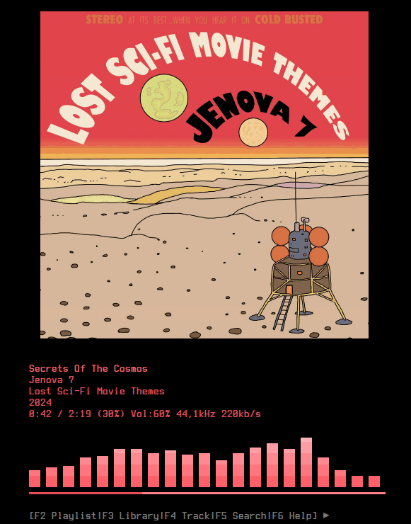

# kew
[](https://github.com/ravachol/kew/blob/master/LICENSE)

Listen to music in the terminal.

  
*Example screenshot running in Konsole: [Jenova 7: Lost Sci-Fi Movie Themes](https://jenova7.bandcamp.com/album/lost-sci-fi-movie-themes).*


  

kew (/kjuː/) is a terminal music player for Linux.

## Features

 * Search a music library with partial titles.
 * Creates a playlist based on a matched directory.
 * Control the player with previous, next and pause.
 * Edit the playlist by adding and removing songs.
 * Supports gapless playback (between files of the same format and type).
 * Supports MP3, FLAC, MPEG-4 (AAC, M4A), OPUS, OGG and WAV audio.
 * Supports desktop events through MPRIS.
 * Private, no data is collected by kew.

## Installing

<a href="https://repology.org/project/kew/versions"></a>


### Installing with package managers

kew is available from Ubuntu 24.04.

```bash
sudo apt install kew         (Debian, Ubuntu)
sudo yay -S kew              (Arch Linux, Manjaro)
sudo yay -S kew-git          (Arch Linux, Manjaro)
sudo zypper install kew      (OpenSUSE)
sudo pkg install kew         (FreeBSD)
brew install kew             (Linux Only, No macOS yet*)
```
*macOS is supported if you build manually. See below.

### Standalone AppImage for musl systems

If you are running a musl-based system, for instance Alpine Linux, you can download a standalone appImage of kew:

https://github.com/ravachol/kew/releases/tag/stable-musl

### Building the project manually

kew dependencies are:

* FFmpeg
* FFTW
* Chafa
* libopus
* opusfile
* libvorbis
* pkg-config
* glib2.0 and AVFormat. These should be installed with the others, if not install them.
* libnotify (optional)

Install these dependencies using your distro's package manager. For instance:

#### For Debian/Ubuntu:

```bash
sudo apt install -y pkg-config ffmpeg libfftw3-dev libopus-dev libopusfile-dev libvorbis-dev git gcc make libchafa-dev libavformat-dev libnotify-dev

```

#### For Arch Linux:

```bash
sudo pacman -Syu --noconfirm --needed pkg-config ffmpeg fftw git gcc make chafa glib2 opus opusfile libvorbis libnotify
```

#### For macOS:

```bash
brew install gettext ffmpeg chafa fftw opus opusfile libvorbis glib pkg-config make git
```
Notes for mac users: 
1) A sixel-capable terminal like kitty or WezTerm is recommended for macOS. 
2) The visualizer and album colors are disabled by default on macOS, because the default terminal doesn't handle them too well. To enable press v and i respectively.

#### For Fedora:

```bash
dnf install -y pkg-config ffmpeg-free-devel fftw-devel opus-devel opusfile-devel libvorbis-devel git gcc make chafa-devel libavformat-free-devel libnotify-devel libatomic
```

#### For OpenSUSE:

```bash
sudo zypper install -y pkg-config ffmpeg fftw-devel opus-devel opusfile-devel libvorbis-devel git chafa-devel gcc make libavformat-devel libnotify-devel
```

#### For CentOS/RHEL:

```bash
sudo yum install -y pkgconfig ffmpeg fftw-devel opus-devel opusfile-devel libvorbis-devel git gcc make chafa-devel libavformat-devel libnotify-devel
```

#### For Solus

```bash
sudo eopkg install -y pkg-config ffmpeg fftw-devel opus-devel opusfile-devel libvorbis-devel git gcc make chafa-devel libavformat-devel libnotify-devel
```

#### For Guix

```bash
guix install pkg-config ffmpeg fftw git gcc make chafa libavformat opus opusfile libvorbis libnotify
```

#### For Void Linux

```bash
sudo xbps-install -y pkg-config ffmpeg fftw git gcc make chafa libavformat opus opusfile libvorbis libnotify-devel
```

Notice that for some packages not only the library needs to be installed, but also development packages, for instance libopus-dev or opus-devel.

Then run this (either git clone or unzip a release zip into a folder of your choice):

```bash
git clone https://github.com/ravachol/kew.git
```
```bash
cd kew
```
```bash
make -ij4
```
```bash
sudo make install
```

A sixel (or equivalent) capable terminal is recommended, like Konsole or kitty, to display images properly.

For a complete list of capable terminals, see this page: [Sixels in Terminal](https://www.arewesixelyet.com/).

#### LibNotify is (should be) optional
By default, the build system will automatically detect if `libnotify` is available and include it and enable notifications if found. 

### Uninstalling

If you installed kew manually, simply run:

```bash
sudo make uninstall
```

## Usage

Run kew. It will first help you set the path to your music folder, then show you that folder's contents.

kew can also be told to play a certain music from the command line. It automatically creates a playlist based on a partial name of a track or directory:

```bash
kew cure great
```

This command plays all songs from "The Cure Greatest Hits" directory, provided it's in your music library.

kew returns the first directory or file whose name matches the string you provide. It works best when your music library is organized in this way: artist folder->album folder(s)->track(s).

#### Some Examples:

 ```
kew (starting kew with no arguments opens the library view where you can choose what to play)

kew all (plays all songs, up to 20 000, in your library, shuffled)

kew albums (plays all albums, up to 2000, randomly one after the other)

kew moonlight son (finds and plays moonlight sonata)

kew moon (finds and plays moonlight sonata)

kew beet (finds and plays all music files under "beethoven" directory)

kew dir <album name> (sometimes it's necessary to specify it's a directory you want)

kew song <song> (or a song)

kew list <playlist> (or a playlist)

kew shuffle <album name> (shuffles the playlist)

kew artistA:artistB:artistC (plays all three artists, shuffled)

kew --help, -? or -h

kew --version or -v

kew --nocover

kew --noui (completely hides the UI)

kew -q <song>, --quitonstop (exits after finishing playing the playlist)

kew -e <song>, --exact (specifies you want an exact (but not case sensitive) match, of for instance an album)

kew . loads kew.m3u

kew path "/home/joe/Musik/" (changes the path)

 ```

Put single-quotes inside quotes "guns n' roses"

#### Key Bindings
* Use <kbd>+</kbd> (or <kbd>=</kbd>), <kbd>-</kbd> keys to adjust the volume.
* Use <kbd>←</kbd>, <kbd>→</kbd> or <kbd>h</kbd>, <kbd>l</kbd> keys to switch tracks.
* <kbd>Space</kbd>, <kbd>p</kbd> to toggle pause.
* <kbd>F2</kbd> to show/hide the playlist and information about kew.
* <kbd>F3</kbd> to show/hide the library.
* <kbd>F4</kbd> to show/hide the track view.
* <kbd>F5</kbd> to search.
* <kbd>F6</kbd> to show/hide key bindings.
* <kbd>u</kbd> to update the library.
* <kbd>v</kbd> to toggle the spectrum visualizer.
* <kbd>i</kbd> to switch between using your regular color scheme or colors derived from the track cover.
* <kbd>b</kbd> to toggle album covers drawn in ascii or as a normal image.
* <kbd>r</kbd> to repeat the current song.
* <kbd>s</kbd> to shuffle the playlist.
* <kbd>a</kbd> to seek back.
* <kbd>d</kbd> to seek forward.
* <kbd>x</kbd> to save the currently loaded playlist to a m3u file in your music folder.
* <kbd>gg</kbd> go to first song.
* number +<kbd>G</kbd>, <kbd>g</kbd> or <kbd>Enter</kbd>, go to specific song number in the playlist.
* <kbd>g</kbd> go to last song.
* . to add current song to kew.m3u (run with "kew .").
* <kbd>Esc</kbd> to quit.

## Configuration

kew will create a config file, kewrc, in a kew folder in your default config directory for instance ~/.config/kew. There you can change some settings like key bindings and the default colors of the app. To edit this file please make sure you quit kew first.

## Nerd Fonts

kew looks better with Nerd Fonts: https://www.nerdfonts.com/.

## License

Licensed under GPL. [See LICENSE for more information](https://github.com/ravachol/kew/blob/main/LICENSE).

## Attributions

kew makes use of the following great open source projects:

Chafa by  Petter Jansson - https://hpjansson.org/chafa/

FFmpeg by FFmpeg team - https://ffmpeg.org/

FFTW by Matteo Frigo and Steven G. Johnson - https://www.fftw.org/

Libopus by Opus - https://opus-codec.org/

Libvorbis by Xiph.org - https://xiph.org/

Miniaudio by David Reid - https://github.com/mackron/miniaudio

Img_To_Txt by Danny Burrows - https://github.com/danny-burrows/img_to_txt


Comments? Suggestions? Send mail to kew-music-player@proton.me.
