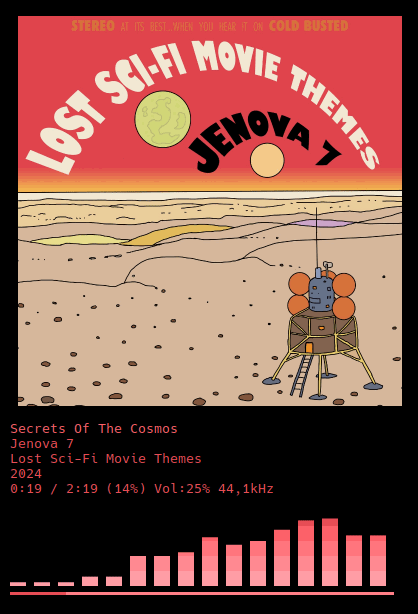
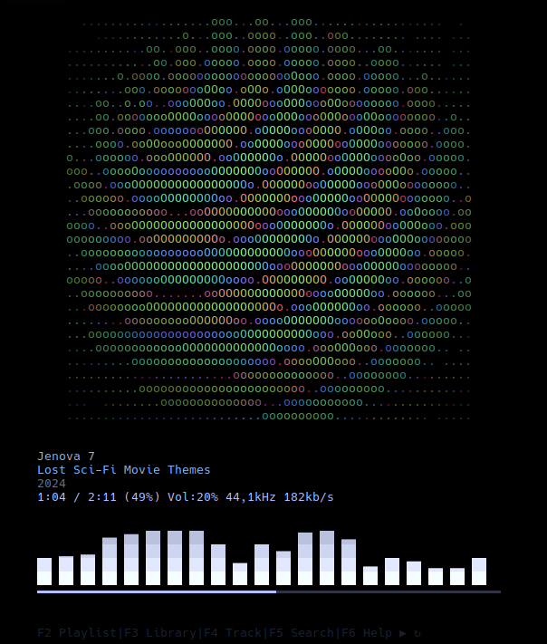

<div align="center">
  
</div>

<br>

<div align="center">
  <a href="https://jenova7.bandcamp.com/album/lost-sci-fi-movie-themes">
    
  </a>
  <br>
  Screenshot showing <a href="https://jenova7.bandcamp.com/album/lost-sci-fi-movie-themes">
    Jenova 7: Lost Sci-Fi Movie Themes
  </a>.
</div>
<br><br>

[](./LICENSE)
<br>
**English** | [简体中文](README_zh_CN.md)
<br>
<br>

kew (/kjuː/) is a terminal music player.

## Features

 * Search a music library with partial titles from the command-line.
 * Creates a playlist automatically based on matched song, album or artist.
 * Private, no data is collected by kew.
 * Music without distractions or algorithmic manipulation.
 * Full color covers in sixel-capable terminals.
 * Visualizer with various settings.
 * Edit the playlist by adding, removing and reordering songs.
 * Gapless playback.
 * Explore the library and enqueue files or folders.
 * Search your music library and add to the queue.
 * Supports MP3, FLAC, MPEG-4/M4A (AAC), OPUS, OGG, Webm and WAV audio.
 * Supports desktop events through MPRIS.
 * Supports lyrics through .lrc files, embedded SYLT (Mp3) or Vorbis comments (Flac,Ogg,Opus).
 * Use themes or colors derived from covers.

## Installing

<a href="https://repology.org/project/kew/versions"></a>

Install through your package manager or homebrew (macOS). If you can't find it on your distro, or you want the bleeding edge, follow the [Manual Installation Instructions](docs/MANUAL-INSTALL-INSTRUCTIONS.md).

## Usage

kew creates a playlist with the contents of the first directory or file whose name matches the arguments you provide in the command-line.

```bash
kew cure great
```

This creates and starts playing a playlist with 'The cure greatest hits' if it's in your music library.

It works best when your music library is organized this way:

artist folder->album folder(s)->track(s).

### Example commands

```
kew (starting kew with no arguments opens the library view where you can choose what to play)

kew all (plays all songs, up to 20 000, in your library, shuffled)

kew albums (plays all albums, up to 2000, randomly one after the other)

kew moonlight son (finds and plays moonlight sonata)

kew moon (finds and plays moonlight sonata)

kew beet (finds and plays all music files under "beethoven" directory)

kew dir <album name> (sometimes, if names collide, it's necessary to specify it's a directory you want)

kew song <song> (or a song)

kew list <playlist> (or a playlist)

kew theme midnight (sets the 'midnight.theme' theme).

kew shuffle <album name> (shuffles the playlist. shuffle needs to come first.)

kew artistA:artistB:artistC (plays all three artists, shuffled)

kew --help, -? or -h

kew --version or -v

kew --nocover

kew --noui (completely hides the UI)

kew -q <song>, --quitonstop (exits after finishing playing the playlist)

kew -e <song>, --exact (specifies you want an exact (but not case sensitive) match, of for instance an album)

kew . loads kew favorites.m3u

kew path "/home/joe/Musik/" (changes the path)

 ```

### Key Bindings

#### Basic

* <kbd>Enter</kbd> to play or enqueue/dequeue.
* <kbd>Space</kbd>, <kbd>p</kbd> or right mouse to play or pause.
* Use <kbd>+</kbd> (or <kbd>=</kbd>), <kbd>-</kbd> keys to adjust the volume.
* Use <kbd>←</kbd>, <kbd>→</kbd> or <kbd>h</kbd>, <kbd>l</kbd> keys to switch tracks.
* <kbd>Alt+s</kbd> to stop.
* <kbd>F2</kbd> or <kbd>Shift+z</kbd> (macOS/Android) to show/hide playlist view.
* <kbd>F3</kbd> or <kbd>Shift+x</kbd> (macOS/Android) to show/hide library view.
* <kbd>F4</kbd> or <kbd>Shift+c</kbd> (macOS/Android) to show/hide track view.
* <kbd>F5</kbd> or <kbd>Shift+v</kbd> (macOS/Android) to show/hide search view.
* <kbd>F6</kbd> or <kbd>Shift+b</kbd> (macOS/Android) to show/hide key bindings view.
* <kbd>i</kbd> to cycle colors derived from kewrc, theme or track cover.
* <kbd>t</kbd> to cycle themes.
* <kbd>Backspace</kbd> to clear the playlist.
* <kbd>Delete</kbd> to remove a single playlist entry.
* <kbd>r</kbd> to cycle repeat settings (repeat, repeat list, off).
* <kbd>s</kbd> to shuffle the playlist.

#### Advanced

* <kbd>u</kbd> to update the library.
* <kbd>m</kbd> show full page lyrics in track view. See [Lyrics](#lyrics)
* <kbd>v</kbd> to toggle the visualizer.
* <kbd>b</kbd> to toggle album covers drawn in ascii or as a normal image.
* <kbd>n</kbd> to toggle notifications.
* <kbd>a</kbd> to seek back.
* <kbd>d</kbd> to seek forward.
* <kbd>x</kbd> to save the currently loaded playlist to a m3u file in your music folder.
* <kbd>Tab</kbd> to switch to next view.
* <kbd>Shift+Tab</kbd> to switch to previous view.

* <kbd>f</kbd>, <kbd>g</kbd> to move songs up or down the playlist.
* number + <kbd>G</kbd> or <kbd>Enter</kbd> to go to specific song number in the playlist.
* <kbd>.</kbd> to add currently playing song to kew favorites.m3u (run with "kew .").
* <kbd>Esc</kbd> to quit.

## Configuration

Linux: ~/.config/kew/

macOS: ~/Library/Preferences/kew/

Key bindings can be added like this:

bind = +, volUp, +5%

If you have an old install of kew, delete the kewrc file to make this style of bindings appear.

## Themes

Press t to cycle available themes.

To set a theme from the command-line, run:

```bash
kew theme <themename> (ie 'kew theme midnight')
```

Put themes in \~/.config/kew/themes (\~/Library/Preferences/kew/themes on macOS).

Do not edit the included themes as they are managed by kew. Instead make a copy with a different name and edit that.

Try the theme editor (by @bholroyd): [https://bholroyd.github.io/Kew-tip/](https://bholroyd.github.io/Kew-tip/).

<!--FIXME: Enable Chroma
## Visulizations / Chroma

You can add visualizations to kew by installing Chroma:

https://github.com/yuri-xyz/chroma

These are enabled when a song doesn't have a cover.

You can also enable and cycle through them by pressing <kbd>c</kbd>.

Disable by pressing <kbd>b</kbd>.

<div align="center">
  <a href="https://jenova7.bandcamp.com/album/lost-sci-fi-movie-themes">
    
  </a>
</div>
<br><br>-->

## If Colors or Graphics Look Wrong

Cycle <kbd>i</kbd> until they look right.

Press <kbd>v</kbd> to turn off visualizer.

Press <kbd>b</kbd> for ASCII covers.

A terminal emulator that can handle TrueColor and sixels is recommended. See [Sixels in Terminal](https://www.arewesixelyet.com/).

## Lyrics

Lyrics can be read from a provided .lrc file that matches the audio file in name and content, from Vorbis comment metadata or from SYLT embedded tags on mp3 files.

Timestamped lyrics will be shown automatically in track view. Press <kbd>m</kbd> show full page lyrics.

## Playlists

To load a playlist: type kew list <name>

To export a playlist, press x. This will save a file in your music path with the name of the first song in the queue.

There is also a favorites playlist function:

Add current song: press <kbd>.</kbd>

To load 'kew list fav':

```bash
kew .
```

## License

Licensed under GPL. [See LICENSE for more information](./LICENSE).


## Attributions

<details>
<summary>Attributions</summary>

kew makes use of the following great open source projects:

Chafa by Hans Petter Jansson - https://hpjansson.org/chafa/

Chroma by yuri-xyz - https://github.com/yuri-xyz/chroma

TagLib by TagLib Team - https://taglib.org/

Faad2 by fabian_deb, knik, menno - https://sourceforge.net/projects/faac/

FFTW by Matteo Frigo and Steven G. Johnson - https://www.fftw.org/

Libopus by Opus - https://opus-codec.org/

Libvorbis by Xiph.org - https://xiph.org/

Miniaudio by David Reid - https://github.com/mackron/miniaudio

Minimp4 by Lieff - https://github.com/lieff/minimp4

Nestegg by Mozilla - https://github.com/mozilla/nestegg

Img_To_Txt by Danny Burrows - https://github.com/danny-burrows/img_to_txt

TermBox2 (adapted for input handling only) - By nsf and Adam Saponara https://github.com/termbox/termbox2

</details>

## Authors

See [AUTHORS](./docs/AUTHORS.md).

## Contact

Comments? Suggestions? Send mail to kew-player@proton.me.
