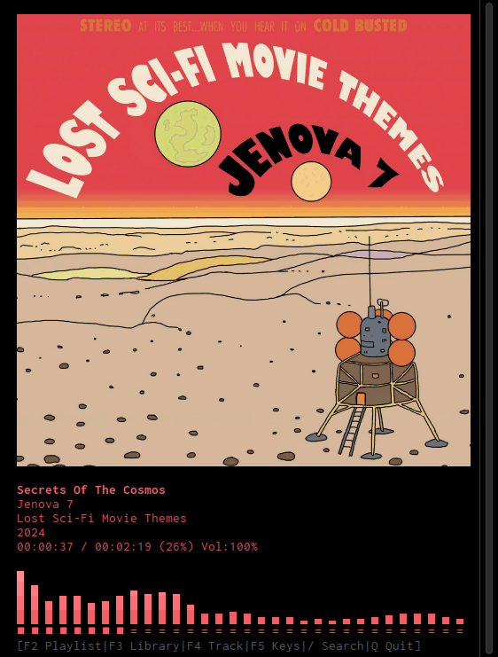

# kew
[](https://github.com/ravachol/kew/blob/master/LICENSE)

Listen to music in the terminal.

<div align="center">
    
</div>

kew (/kjuː/) is a command-line music player for Linux.

## Features

 * Search a music library with partial titles.
 * Creates a playlist based on a matched directory.
 * Display album covers as ASCII art or as a normal image.
 * Control the player with previous, next and pause.
 * Has gapless playback (between files of the same format and type) and supports 24-bit audio.
 * Private and offline, no data is collected by kew.

## Caveats
 * Does not yet work well with very long audio files that are not mp3, wav, flac, ogg or opus.
 * Seeking is disabled for ogg vorbis files.

## Name Change

Had to rename cue to kew to resolve a name conflict. The meaning and pronounciation hasn't changed. Hope most of you can accept the new name. I think it gives the app more of a distinct identity.


## Reviews

kew was reviewed by Linuxlinks.com:

https://www.linuxlinks.com/kew-command-line-music-player/

https://www.linuxlinks.com/cue-command-line-music-player-gapless-playback/

And Tecmint.com:

https://www.tecmint.com/command-line-music-players-for-linux/

Thank you!


## Installing

<a href="https://repology.org/project/kew/versions"></a>

### Installing on Debian

Under Debian Sid/Unstable you can run:

```bash
$ sudo apt install kew
```

### Installing via AUR

On Arch Linux, and Arch-based distributions, kew can be found in the AUR. Install with pamac or an AUR helper like yay:

```bash
$ yay kew-git
```

Or

```bash
$ yay kew
```

### Installing via Brew

For [Homebrew](https://brew.sh/) user, you can install [kew](https://formulae.brew.sh/formula/kew) with:

```bash
$ brew install kew
```

### Installing with quick install script

To quickly install kew, just copy and paste this to your terminal (if you have curl installed):

```bash
sudo bash -c "curl https://raw.githubusercontent.com/ravachol/kew/main/install.sh | bash"
```

Please note that this script might do a system update before installing kew.

### Installing everything manually

kew dependencies are:

* FFmpeg
* FFTW
* Chafa
* FreeImage
* libopus
* opusfile
* libvorbis
* pkg-config
* glib2.0 and AVFormat. These should be installed with the others, if not install them.

Install FFmpeg, FFTW, Chafa and FreeImage using your distro's package manager. For instance:

```bash
apt install ffmpeg libfftw3-dev libopus-dev libopusfile-dev libvorbis-dev git gcc make libchafa-dev libfreeimage-dev libavformat-dev libglib2.0-dev
```
Or:

```bash
pacman -Syu ffmpeg fftw git gcc make chafa freeimage glib2 opus opusfile libvorbis
```

Then run this (either git clone or unzip a release zip into a folder of your choice):

```bash
git clone https://github.com/ravachol/kew.git
```
```bash
cd kew
```
```bash
make
```
```bash
sudo make install
```

A TrueColor capable terminal is recommended, like Konsole, kitty or st, to display colors properly.

For a complete list of capable terminals, see this page: [Colors in Terminal](https://gist.github.com/CMCDragonkai/146100155ecd79c7dac19a9e23e6a362) (github.com).

### Uninstalling

```bash
sudo make uninstall
```

## Usage

In case you don't have a "Music" folder in your home folder, the first thing to do is to tell kew the path to your music library (you only need to do this once):

```bash
kew path "/home/joe/Musik/"
```
Now run kew and provide a partial name of a track or directory:

```bash
kew cure great
```

This command plays all songs from "The Cure Greatest Hits" directory, provided it's in your music library.

kew returns the first directory or file whose name matches the string you provide. It works best when your music library is organized in this way: artist folder->album folder(s)->track(s).

#### Some Examples:

 ```
kew (starting kew with no arguments opens the library view where can choose what to play)

kew all (plays all songs (up to 20 000) in your library, shuffled)

kew moonlight son (finds and plays moonlight sonata)

kew moon (finds and plays moonlight sonata)

kew beet (finds and plays all music files under "beethoven" directory)

kew dir <album name> (sometimes it's necessary to specify it's a directory you want)

kew song <song> (or a song)

kew list <playlist> (or a playlist)

kew shuffle <album name> (shuffles the playlist)

kew artistA:artistB:artistC (plays all three artists, shuffled)

kew --help, -? or -h

kew --version or -v

kew --nocover

kew --noui (completely hides the UI)

kew . loads kew.m3u

 ```

Put single-quotes inside quotes "guns n' roses"

#### Key Bindings
* Use <kbd>+</kbd>, <kbd>-</kbd> keys to adjust the volume.
* Use <kbd>←</kbd>, <kbd>→</kbd> or <kbd>h</kbd>, <kbd>l</kbd> keys to switch tracks.
* <kbd>Space</kbd>, <kbd>P</kbd> to toggle pause.
* <kbd>F2</kbd> to show/hide the playlist and information about kew.
* <kbd>F3</kbd> to show/hide key bindings.
* <kbd>v</kbd> to toggle the spectrum visualizer.
* <kbd>c</kbd> to toggle album covers.
* <kbd>i</kbd> to switch between using your regular color scheme or colors derived from the track cover.
* <kbd>b</kbd> to toggle album covers drawn in ascii or as a normal image.
* <kbd>r</kbd> to repeat the current song.
* <kbd>s</kbd> to shuffle the playlist.
* <kbd>a</kbd> to seek back.
* <kbd>d</kbd> to seek forward.
* <kbd>x</kbd> to save the currently loaded playlist to a m3u file in your music folder.
* <kbd>gg</kbd> go to first song.
* number +<kbd>G</kbd>, <kbd>g</kbd> or <kbd>Enter</kbd>, go to specific song number in the playlist.
* <kbd>g</kbd> go to last song.
* . to add current song to kew.m3u (run with "kew .").
* <kbd>q</kbd> to quit.

## Configuration

kew will create a config file, kewrc, in your default config directory for instance ~/.config/. There you can change key bindings, number of bars in the visualizer and whether to use the album cover for color, or your regular color scheme (default). To edit this file please make sure you quit kew first.

## License

Licensed under GPL. [See LICENSE for more information](https://github.com/ravachol/kew/blob/main/LICENSE).

## Attributions

Kew makes use of the following great open source projects:

Chafa by  Petter Jansson - https://hpjansson.org/chafa/

FFmpeg by FFmpeg team - https://ffmpeg.org/

FFTW by Matteo Frigo and Steven G. Johnson - https://www.fftw.org/

Libopus by Opus - https://opus-codec.org/

Libvorbis by Xiph.org - https://xiph.org/

Miniaudio by David Reid - https://github.com/mackron/miniaudio

Img_To_Txt by Danny Burrows - https://github.com/danny-burrows/img_to_txt


Comments? Suggestions? Send mail to kew-music-player@proton.me.
