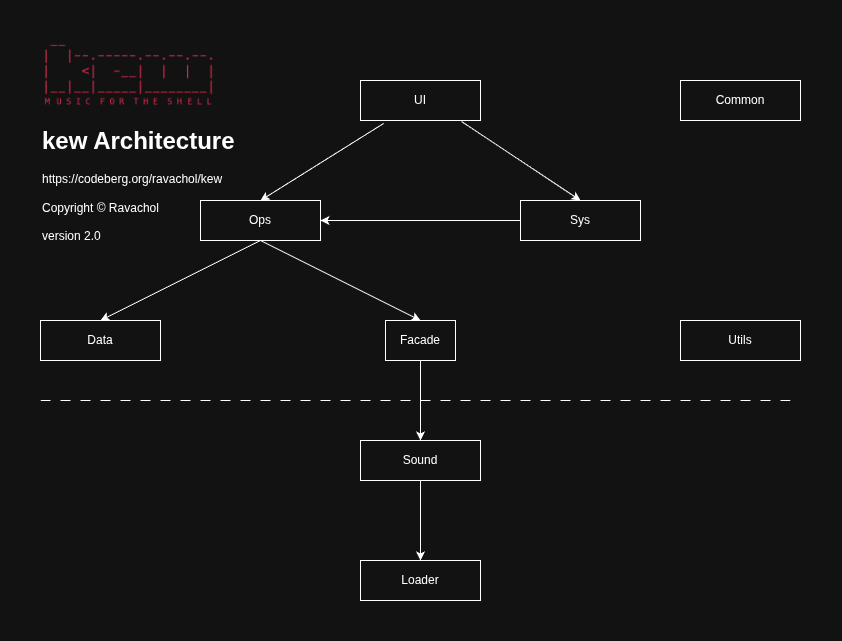

# DEVELOPERS

## Getting started

This document will help you setup your development environment. It is intended to be beginner friendly as we welcome and encourage people who are just starting to learn about programming in C to contribute to this project. We also welcome senior developers of course, but much of this document will be redundant if you are experienced.

### Problems

If you run into any problems just ask for help in an email to kew-player@protonmail.com or in the PR itself.

### Prerequisites

Before contributing, ensure you have the following tools installed on your development machine:

- [GCC](https://gcc.gnu.org/) (or another compatible C/C++ compiler)
- [Make](https://www.gnu.org/software/make/)
- [Git](https://git-scm.com/)
- [Valgrind](http://valgrind.org/) (optional, for memory debugging and profiling)
- [VSCodium](https://vscodium.com/) or [VSCode](https://code.visualstudio.com/) (or other debugger)

### Building the Project

1. Clone the repository:
   ```
   git clone https://codeberg.org/ravachol/kew.git --single-branch --branch develop
   cd kew
   ```

2. To enable debugging symbols, run make with DEBUG=1

3. Build the project:
   ```
   make DEBUG=1 -j$(nproc)  # Use all available processor cores for faster builds
   ```

### camelCase instead of snake_case

kew uses camelCase, which is unorthodox, but it's what I am used to from my background in other languages.
There are plenty of examples of projects using other things than strict snake_case in c. Please respect this choice in your contributions.

### Commenting

Please refrain from using a lot of comments, and make sure that they are in English. I am not a big believer in comments and avoid commenting as much as possible. If you feel you need to add a comment, please first consider if you can make the function or variable names clearer, or if you can structure the code differently so that it is simpler and the intent is clear, or if you can make the code block into a function with a name that explains crystally clear what is going on. If you used AI make sure to remove comments that aren't strictly needed.

### Architecture



kew follows the above architecture, so that function calls only go in the direction of the arrows. For instance, functions in ops module never call functions in ui module as there is no arrow pointing from ops to ui. Please make sure your PR follows this architecture, and place your code in the correct module. If you have doubts in where to place it, just ask.

### Debugging with VSCodium

1. Install extension clangd, C/C++ Debug (gdb) and EditorConfig.

2. Install the program bear that can generate a compile_commands.json. This helps clangd find libs.

3. Run bear -- make.

This should enable you to develop kew on VSCodium.

### Debugging with Visual Studio Code

To enable debugging in VSCode, you'll need to create a `launch.json` file that configures the debugger. Follow these steps:

1. Open your project's folder in VSCode.

2. Press `F5` or go to the "Run and Debug" sidebar (`Ctrl+Shift+D` on Windows/Linux, `Cmd+Shift+D` on macOS), then click on the gear icon to create a new launch configuration file.

3. Select "C++ (GDB/LLDB)" as the debugger type, and choose your platform (e.g., x64-linux, x86-win32, etc.).

4. Replace the contents of the generated `launch.json` file with the following, adjusting paths and arguments as needed:

   ```json
   {
    "version": "0.2.0",
    "configurations": [


        {
            "name": "kew",
            "type": "cppdbg",
            "request": "launch",
            "program": "${workspaceFolder}/kew",
	    //"args": ["artist or song name"],
            "stopAtEntry": false,
            "cwd": "${workspaceFolder}",
            "environment": [],
            "externalConsole": true,
            "MIMode": "gdb",
            "setupCommands": [
                {
                    "description": "Enable pretty-printing for gdb",
                    "text": "-enable-pretty-printing",
                    "ignoreFailures": true
                }
            ]
        }
    ]
   }
   ```

5. Save the `launch.json` file.

6. Create a c_cpp_properties.json file in the same folder (.vscode) with the following contents adjusting paths and arguments as needed:

    ```json
    {
        "configurations": [
                {
                        "name": "linux-gcc-x64",
                        "includePath": [
                                "${workspaceFolder}/include/miniaudio",
                                "${workspaceFolder}/include/nestegg",
                                "${workspaceFolder}/**",
                                "/usr/include",
                                "/usr/include/opus",
                                "/usr/include/vorbis",
                                "/usr/include/chafa/",
                                "/lib/chafa/include",
                                "/usr/include/glib-2.0",
                                "/usr/lib/glib-2.0/include",
                                "/usr/include/libmount",
                                "/usr/include/blkid",
                                "/usr/include/sysprof-6",
                                "/usr/include/glib-2.0/gio",
                                "/usr/include/glib-2.0",
                                "${workspaceFolder}/include"
                        ],
                        "browse": {
                                "path": [
                                        "${workspaceFolder}/include/miniaudio",
                                        "${workspaceFolder}/src",
                                        "${workspaceFolder}/include",
                                        "${workspaceFolder}/**"
                                ],
                                "limitSymbolsToIncludedHeaders": true
                        },
                        "defines": [
                                "_POSIX_C_SOURCE=200809L"
                        ],
                        "compilerPath": "/usr/bin/gcc",
                        "cStandard": "${default}",
                        "cppStandard": "${default}",
                        "intelliSenseMode": "linux-gcc-x64"
                }
        ],
        "version": 4
    }

    ```

7. Add the extensions C/C++, C/C++ Extension pack, C/C++ Themes (optional).

8. Now you can use VSCode's debugger to step through your code, inspect variables, and analyze any issues:

        * Set breakpoints in your source code by placing your cursor on the desired line number, then press `F9`.
        * Press `F5` or click on the "Start Debugging" button (or go to the "Run and Debug" sidebar) to start the debugger.
        * When the execution reaches a breakpoint, VSCode will pause, allowing you to use its built-in features for debugging.


#### Finding where libs are located

If the paths in c_cpp_properties.json are wrong for your OS, to find the folder where for instance Chafa library is installed, you can use one of the following methods:

1. **Using `pkg-config`**:

   The `pkg-config` tool is a helper tool used to determine compiler flags and linker flags for libraries. You can use it to find the location of Chafa's include directory. Open your terminal and run the following command:

   ```
   pkg-config --cflags chafa
   ```

   This should display the `-I` flags required to include Chafa's headers, which in turn will reveal the installation prefix (e.g., `/usr/include/chafa/`). The folder containing the library files itself is typically located under `lib` or `lib64`, so you can find it by looking for a folder named `chafa` within those directories.

2. **Using `brew` (for macOS)**:

   If you installed Chafa using Homebrew, you can find its installation prefix with the following command:

   ```
   brew --prefix chafa
   ```

   This will display the installation prefix for Chafa (e.g., `/usr/local/opt/chafa`).

3. **Manually searching**:

   Alternatively, you can search your file system manually for the `chafa` folder or library files. On Unix-based systems like Linux and macOS, libraries are typically installed under `/usr`, `/usr/local`, or within the user's home directory (e.g., `~/.local`). You can use the `find` command to search for the folder:

   ```
   find /usr /usr/local ~/.local -name chafa
   ```

   This should display the location of the Chafa installation, revealing both the include and library folders.

### Valgrind

To use Valgrind for memory debugging and profiling:

1. Build kew with debug symbols. Run this command: make DEBUG=1 -j4

2. Run Valgrind on your binary:
   ```
   valgrind --leak-check=full --track-origins=yes --show-leak-kinds=all --log-file=valgrind-out.txt ./kew
   ```

### Editorconfig

- If you can, use EditorConfig for VS Code Extension. There is a file with settings for it: .editorconfig.

### Contributing

For further information on how to contribute, see CONTRIBUTING.md.
